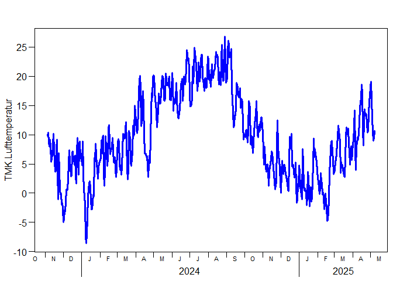

# recent weather
Berry Boessenkool;
2025-05-09, 07:05

This is a git demo in the course
[DS4W](https://open.hpi.de/courses/hpi-dh-wearables2025).  
This repo is also used for the lesson on an R data analysis pipeline.

## Get Data

make sure we have all packages:

``` r
if(!requireNamespace("rdwd", quietly=TRUE))
    install.packages("rdwd")
rdwd::updateRdwd()
```

    rdwd is up to date, compared to github.com/brry/rdwd. Version 1.8.23 (2025-03-27)

download recent weather data using
[rdwd](https://bookdown.org/brry/rdwd/)

``` r
library(rdwd)
link <- selectDWD("Potsdam", res="daily", var="kl", per="recent")
clim <- dataDWD(link, varnames=TRUE, force=24)
```

## visualise recent temperature

``` r
plotDWD(clim, "TMK.Lufttemperatur")
```


